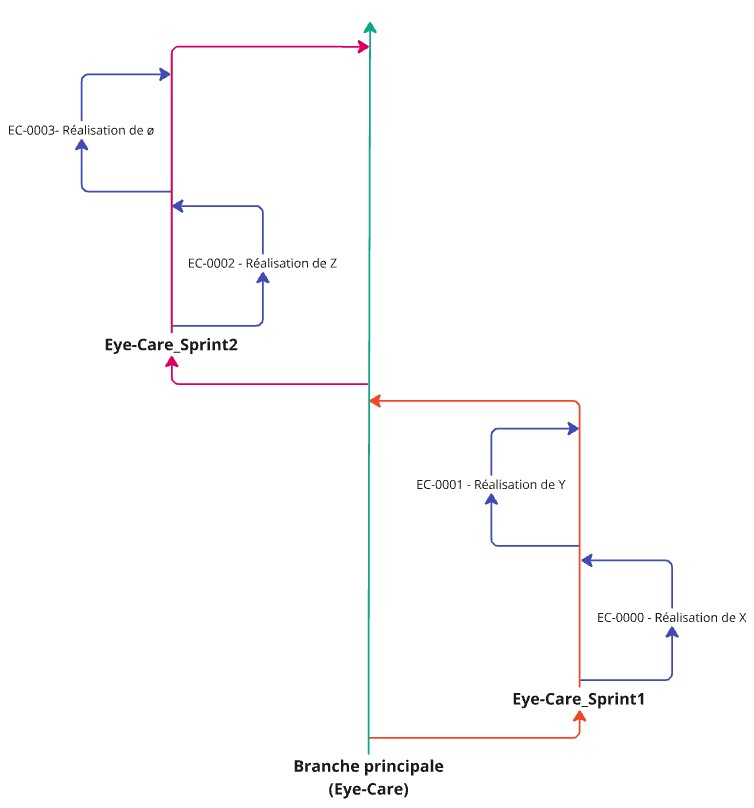
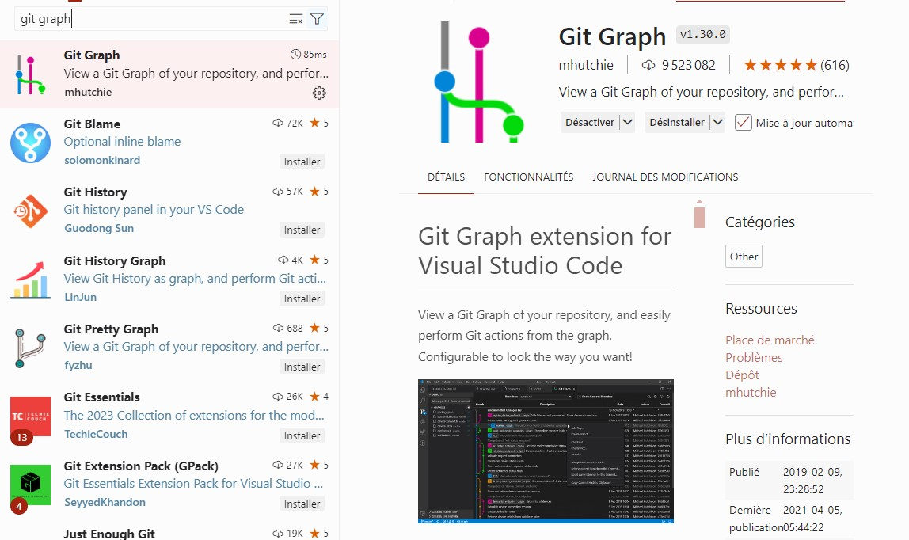
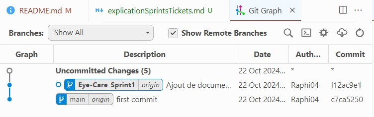
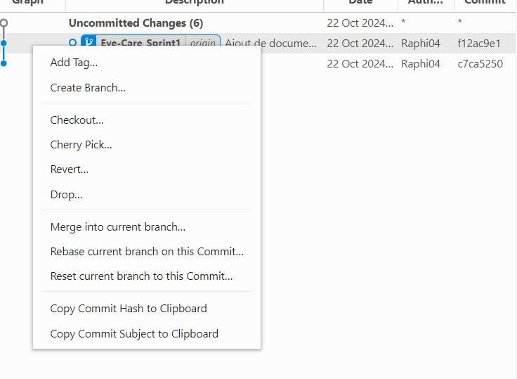
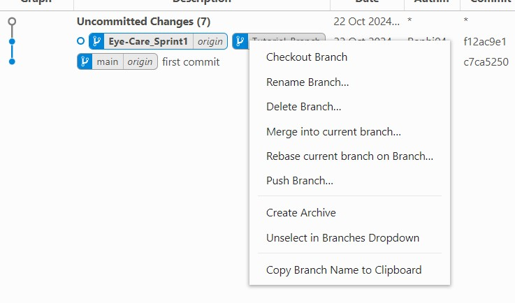
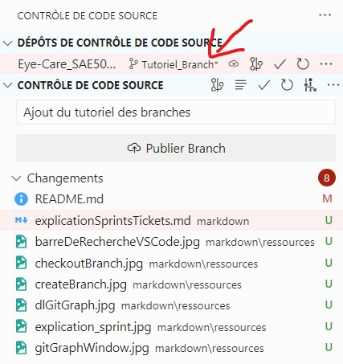
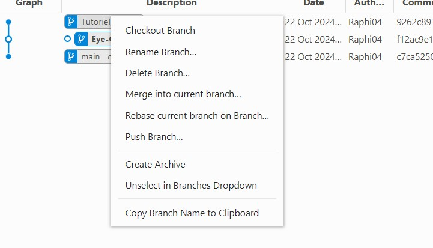

# Explication du fonctionnement des sprints/tickets sur GitHub

> Ce document vous expliquera comment fonctionnera l'organisation du projet sur GitHub, que se soit en terme de sprints ou de tickets.

## Schéma de l'organisation du projet sur GitHub

### Explication du schéma

- Nous avons une branche principale qui ne sera jamais touché directement.

- Nous la modifierons en créant une branche au début de chaque nouveau Sprint que nous appellerons "Eye-Care_SprintX".

- Pour chaque ticket, nous créerons une branche portant le nom de ce dernier et c'est sur celles là que nous modifierons les fichiers du projet.

- Lorsque vous avez terminé un ticket, il vous faudra le merger sur la branche du Sprint correspondant.

- À la fin d'un Sprint, la branche est merge avec la branche principale et une nouvelle branche est créer.

- On recommence le processus jusqu'à la fin du projet.

## Exemple d'utilisation

### Pour faciliter les commandes git, nous allons télécharger l'extension **_Git Graph_** sur **_VS Code_**.

---

### En suite, dans la barre de recherche de VS Code entrez la commande suivante :

`>Git Graph: View Git Graph (git log)`

#### Barre de recherche :

#### Fenêtre de GitGraph :

---

### Pour créer une branche, faîte un click droit sur la ligne qui vous intéresse, puis _Create Branch_ :

---

### Pour vous déplacer sur une branche, faîte un click droit sur la branche qui vous intéresse, puis _Checkout Branch_:

---

### Vérifier bien que vous êtes sur la bonne branche avant de faire votre commit :

---

### Pour merge, il vous suffit de revenir sur la branche du Sprint correspondant avec un _Checkout Branch_, puis faîte un click droit sur la branche que vous voulez merge et faîte _Merge into current branch_ :

---

### Si tout c'est bien passé, vous venez de fusioner votre travail avec celui des autres pour le Sprint actuel

---

- [Retour à la phase de cadrage](phaseCadrage.md)
