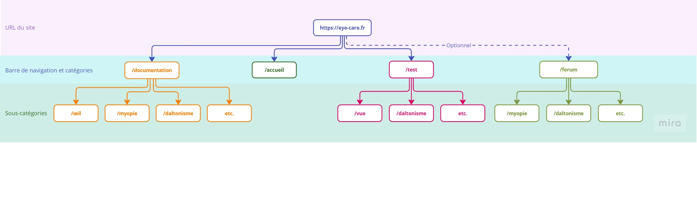
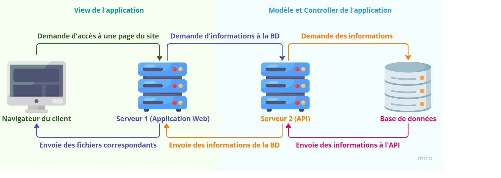
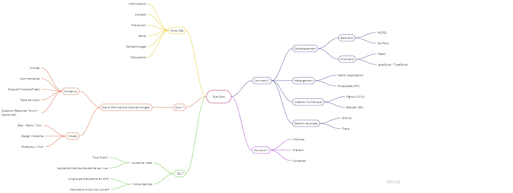

# **Activité 1 : Phase de cadrage**

> Ce document récapitule les ressources humaines allouées au projet et identifie les parties prenantes, leurs rôles et responsabilités. Il expose également le contexte du projet, ses objectifs principaux, les fonctionnalités de l’applications ainsi que la méthodologie de développement et les actions à entreprendre pour en assurer le suivi.

_Source : [Présentation de la SAÉ 5.01](https://elearning.univ-eiffel.fr/pluginfile.php/963273/mod_resource/content/7/content/activities/act1.html)_

## **Distribution des rôles**

### **Nom d'équipe**

Eye-Care

### **Chef d'équipe**

Hugo BAJOUE

### **Rôles**

**Arno LE MOIL** : Dev Front-End | WebDesigner UI/UX | Référent Front-end  
**Hugo BAJOUE** : Chef de Projet | Dev Fullstack  
**Jérémie PARANT** : Dev Back-end | Référent Back-end  
**Matthieu TISSIER** : WebDesigner UI/UX | 3D | Référent WebDesigner  
**Raphael CADETE** : Dev Fullstack | Architecture base de donnée

## **Gestion du projet**

Pour ce projet, nous utiliserons la méthode Agile pour nous organiser. Nous fonctionnerons alors par Sprints de deux semaines, nous rédigerons des tickets que nous associerons aux personnes concernées et nous feront une réunion en visio-conférence tous les dimanches pour faire un point sur l'avancée du projet.

- [Organisation du projet sur GitHub](explicationSprintsTickets.md)

- [Gestion des tickets sur Trello](https://trello.com/invite/b/6716485644ba4a725571bfb6/ATTI9b3d3fd1e713ac72691e5b67eec35a97481582C2/sae501)

## **Planification**

### **Conception du projet (16 octobre au 31 octobre ) :**

- Rédaction du 1er rendu (Note de cadrage) ;
- Conception et Proposition d’implémentation pour le site ;
- Premières propositions de visuel pour le site (chartes graphiques et logo).

### **Tâche à accomplir :**

- Recherche sur l’ophtalmologie ;
- Création des maquettes ;
- Développement de l’API backend ;
- Développement du frontend ;
- Mise en place des tests ;
- Rédaction des articles ;
- Création des visuels en 3D.

## **Architecture et conception**

### **Schéma représentant l'arborescence du site**

### **Schéma représentant l'architecture fonctionnel du site**

### **[Figma contenant la maquette](https://www.figma.com/design/yCE0aSzJkImClMNJHQTMjg/Untitled?node-id=0-1&t=dU6bidFVG8KhXNQ0-1)**

## **Carte mentale**

---

- [Retour au document principal](../README.md)
